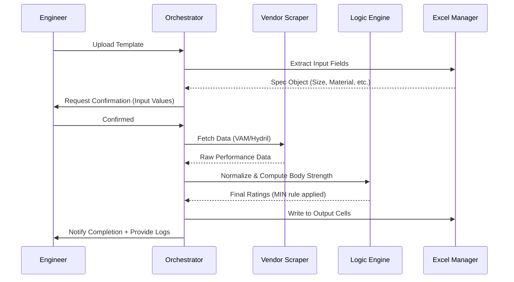
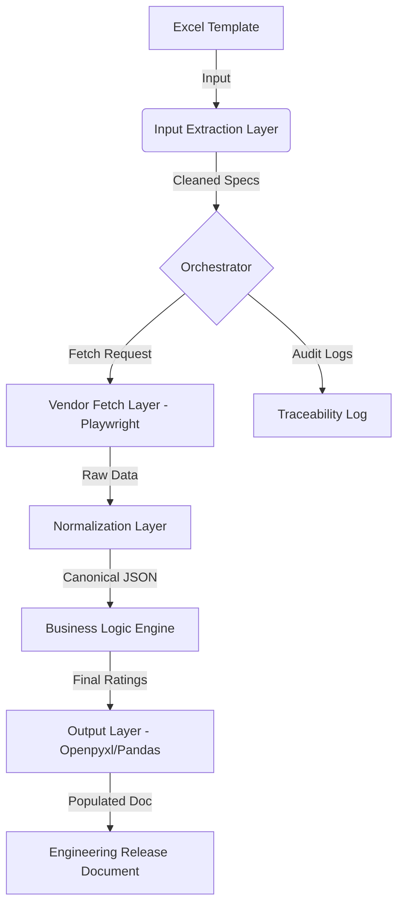

# Product Requirements Document (PRD): ThreadWise

**Status:** Draft / Initial Proposal  
**Date:** March 23, 2026  
**Author:** Senior Product Manager / Systems Architect  

---

## 1. Executive Summary

### Overview
ThreadWise is a specialized engineering automation system designed to streamline the technical evaluation of completion products in the oil and gas sector. The system automates the extraction, normalization, and calculation of tubing/casing thread performance data from diverse vendor platforms (e.g., VAM, Hydril).

### Business Impact
By replacing a manual, repetitive, and error-prone process with a modular automation pipeline, ThreadWise will:
- **Reduce Engineering Lead Time:** Decrease the "Input-to-Release" cycle from hours to minutes.
- **Ensure Data Integrity:** Eliminate human transcription errors in high-stakes technical calculations.
- **Centralize Traceability:** Provide a clear audit trail of source data and internal logic applied to every release document.

---

## 2. Problem Statement

### Current Workflow
Engineers currently perform a "manual swivel-chair" integration:
1.  Extract input parameters (Material, Size, Weight/OD/ID) from an Excel engineering template.
2.  Navigate to multiple vendor websites (VAM, Hydril, etc.).
3.  Manually filter through dropdown menus to find specific connection performance values (Tensile, Compression, Burst, Collapse).
4.  Perform manual body calculations using internal proprietary formulas.
5.  Apply the "Governing Rule": `Final Rating = MIN(Top Connection, Bottom Connection, Body Strength)`.
6.  Re-enter all values into the Excel release sheet.

### Pain Points
- **Schema Inconsistency:** Every vendor website has a unique UI flow and data structure.
- **High Cognitive Load:** Repetitive manual lookup leads to "copy-paste fatigue" and potential catastrophic engineering errors.
- **Non-Value-Add Time:** Senior engineers spend ~20-30% of their time navigating websites rather than designing solutions.

---

## 3. Goals & Non-Goals

### Goals
- **Modular Scraping:** Build a robust, Playwright-based engine to fetch LIVE vendor data.
- **Normalization:** Create a canonical data model to represent connection performance across different vendors.
- **Formula Automation:** Standardize internal body calculations into a Python logic engine.
- **Bidirectional Excel Handling:** Automated reading of inputs and writing of outputs to production templates.
- **Traceability:** Generate a JSON/Markdown log of each run for engineering review.

### Non-Goals
- **Static Database:** We are NOT building a local database of connection values (to avoid data obsolescence).
- **Complex UI:** No React/Next.js frontend for the MVP; the system runs as a CLI or lightweight script.
- **Massive Scalability:** Not intended for high-concurrency; reliability and accuracy are prioritized over throughput.
- **Heavy AI/ML:** No LLM-based logic for calculations; AI is only for structural parsing of edge-case HTML.

---

## 4. User Personas

| Persona | Primary Needs | Pain Points |
| :--- | :--- | :--- |
| **Mechanical Engineer** | Needs accurate, verified values for release documents. | Tired of manual lookup; needs to trust the automated output. |
| **QA/Lead Engineer** | Needs to verify the source of the data and the calculation logic. | Lack of audit trail for manual entries. |
| **Operations Manager** | Needs faster turnaround for work orders. | Current workflow is a bottleneck for project timelines. |

---

## 5. User Flow & Experience

The system is designed to mirror the existing engineer workflow while eliminating manual lookup and entry steps.

### 5.1 High-Level User Flow
1. **Upload/Open Excel Template** → 2. **System Extracts Fields** → 3. **User Validates Inputs** → 4. **System Fetches Vendor Data** → 5. **Internal Calcs & Logic Applied** → 6. **Excel Auto-filled** → 7. **User Review & Save**.

### 5.2 Detailed Step-by-Step Interaction

| Step | User Action | System Processing | Output / Result |
| :--- | :--- | :--- | :--- |
| **1. Load Input** | Selects `.xlsx` template. | Reads file using `openpyxl`. | Identified: Top/Bottom Conn, Size, Material. |
| **2. Extraction** | - | Parses structured fields into a logic object. | JSON: `{"top_conn": "VAM TOP", ...}` |
| **3. Validation** | **Confirms extracted values.** | Displays values for manual verification. | **Built-in Trust Check.** |
| **4. Vendor Fetch** | - | Launches Playwright; Navigates sites; Selects params. | Tensile, Burst, Collapse (Top & Bottom). |
| **5. Normalization** | - | Maps vendor schemas to canonical schema. | Standardized Performance Object. |
| **6. Body Calc** | - | Computes Body Tensile/Burst/Collapse from formulas. | Calculated Body Strength values. |
| **7. Logic Execution** | - | Applies: `Final = MIN(Top, Bottom, Body)`. | Governing Performance Ratings. |
| **8. Autofill** | - | Writes values to target Excel cells (preserving format). | Populated Release Document. |
| **9. Traceability** | - | Generates execution logs (URLs, values, timestamps). | Log File (JSON/Markdown). |
| **10. Delivery** | Reviews output & saves. | Final UI feedback: "Generation Successful." | Completed Engineering Release. |

### 5.3 Sequence Diagram


### 5.4 System States
- **Idle:** Waiting for input.
- **Processing:** Fetching + computing.
- **Validation Required:** User confirmation needed (Trust Check).
- **Completed:** Excel generated successfully.
- **Error:** Issue occurred (Retry/Manual Override).

### 5.5 Alternate Flows (Edge Cases)
- **Vendor Site Failure:** System retries. On persistent failure, it prompts: *"Vendor data could not be fetched. Please verify input or retry."*
- **Missing Data:** Highlight missing fields in the log and allow manual override/entry.
- **Schema Mismatch:** Fallback mapping used; issue flagged in the traceability log.

### 5.6 UX Principles
- **Minimal Clicks:** Target 1-2 clicks to go from input to output.
- **Transparent Data Flow:** All intermediate values are visible in the log for engineer verification.
- **Fail Gracefully:** Hard stop on data ambiguity; no "silent" incorrect values.
- **Maintain Trust:** Continuous validation steps ensure the engineer remains the final authority.

---

## 6. System Architecture (High-Level)

The system is designed as a **Modular Pipeline** to ensure 5–10 years of maintainability.



1.  **Input Extraction Layer:** Python/Openpyxl module to map cell ranges to a `Specs` object.
2.  **Vendor Fetch Layer:** Specialized Playwright scripts (one per vendor) to navigate and extract data.
3.  **Normalization Layer:** Maps "Tension" (VAM) and "Yield" (Hydril) into a common `Tensile` property.
4.  **Logic Engine:** Implements "Body Calculations" and the "Final = Min()" governing rule.
5.  **Output Layer:** Writes calculated values back to specific Excel coordinates.

---

## 7. Functional Requirements

### FR-01: Excel Parsing
- Must support `.xlsx` formats.
- Must extract: Connection Type, Material Grade, Weight, OD, ID, and Length.

### FR-02: Vendor Data Extraction (Live)
- Use Playwright to handle dynamic SPA (Single Page Applications) on vendor sites.
- Handle stateful dropdowns (e.g., selecting "Material" updates "Weight" options).
- Extract: Tensile, Compression, Internal Yield (Burst), and Collapse.

### FR-03: Multi-Vendor Handling
- Modular "Adapter" pattern: Adding a new vendor requires writing a new scraper script, not changing the logic engine.
- Default support for VAM and Hydril.

### FR-04: Calculation Engine
- Implement API-Standard formulas for Body Strength (e.g., API 5CT).
- Apply the governing rule: `Result = MIN(Top Thread, Bottom Thread, Body)`.

### FR-05: Logging & Traceability
- Save a "Source Snapshot" (text/JSON) of what was seen on the vendor site at execution time.
- Generate a summary log showing the `MIN()` logic breakdown.

---

## 8. Non-Functional Requirements

- **Reliability:** 100% accuracy. Any mismatch in vendor data (e.g., missing field) must trigger a "HARD STOP" and human notification.
- **Maintainability:** Modular structure. If VAM website changes, only the `vam_scraper.py` needs an update.
- **Cost Efficiency:** Python/Playwright (Open Source); Minimal compute requirements.
- **Latency:** < 3 minutes per completion configuration (acceptable for engineering batch runs).
- **Scalability:** System handles sequential or small batch processing (1-10 configs).

---

## 9. Data Model / Schema Design

### Canonical Connection Schema (JSON)
```json
{
  "vendor_metadata": { "name": "VAM", "timestamp": "2026-03-23T11:48Z" },
  "performance": {
    "tensile_lb": 500000,
    "compression_lb": 450000,
    "burst_psi": 12000,
    "collapse_psi": 10500
  },
  "physical_specs": { "size_in": 9.625, "weight_ppf": 47.0 }
}
```

### Body Calculation Schema
```json
{
  "body_yield_lb": 1200000,
  "body_burst_psi": 15000,
  "body_collapse_psi": 11000
}
```

---

## 10. API / Module Design (Lightweight)

| Module | Key Functions |
| :--- | :--- |
| `excel_manager.py` | `get_inputs(file_path)`, `write_outputs(file_path, results)` |
| `scrapers/vam_engine.py` | `fetch_vam_data(specs)` |
| `logic_engine.py` | `calculate_body_strength(specs)`, `apply_governing_rule(threads, body)` |
| `orchestrator.py` | `run_workflow(input_file)` |

---

## 11. MVP Scope (1–2 Weeks)

- **Phase 1 (Week 1):** 
  - Build `excel_manager` (Read/Write to 1 specific template).
  - Build `vam_engine` (Scrape VAM website for 1 connection type).
- **Phase 2 (Week 2):**
  - Implement Core `logic_engine` (Body calcs + Min rule).
  - Basic JSON logging for traceability.
  - End-to-end integration test.

---

## 12. Future Enhancements

- **Caching Layer:** Store recently fetched data (vaild for 24h) to speed up repetitive lookups.
- **UI Dashboard:** Streamlit-based dashboard to visualize logs and "manual override" edge cases.
- **AI Validation:** Use Gemini/LLM to verify if a vendor site layout has changed significantly, alerting the developer.
- **Multi-Vendor Expansion:** Add Hydril, Tenaris, and others.

---

## 13. Risks & Mitigations

| Risk | Impact | Mitigation |
| :--- | :--- | :--- |
| **Vendor Site Change** | High | Modular design. Use visual regression alerts or specific element ID checks in Playwright. |
| **Data Mismatch** | High | System Hard Stop. Any "N/A" or "NULL" value blocks calculation and flags the engineer. |
| **Long-term Maintainability** | Medium | Use strict Python type hinting and comprehensive docstrings for future engineers. |

---

## 14. Success Metrics

- **Time Savings:** Target < 2 minutes per entry (vs. 15-30 minutes manual).
- **Zero Calculation Errors:** 0% failure rate in governing rule application compared to manual audits.
- **Engineer NPS:** Qualitative feedback from engineers on "friction reduction."
